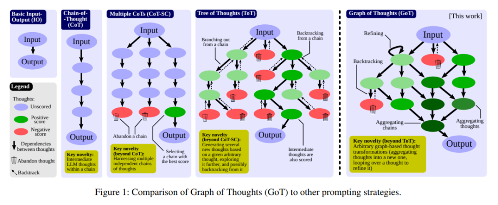

8.28 总结

**思维链**(CoT)

思维链（CoT）便是一种用于设计 prompt 的方法，即 prompt 中除了有任务的输入和输出外，还包含推理的中间步骤（中间思维）。研究表明，CoT 能极大地提升 LLM 的能力，使之无需任何模型更新便能解决一些难题。

实现自我一致的方法（CoT-SC）；这个方案是生成多个 CoT，再选出其中最佳的结果。

思维树（ToT），其做法是通过树（tree）来建模 LLM 推理过程。这能让模型使用不同的思维路径，并能提供全新的功能，比如基于不好的结果反向回溯推理过程。不幸的是，由于 ToT 方法为思维过程强加了严格的树结构，所以会极大限制 prompt 的推理能力。

**思维图(GoT)**

prompt 工程设计是一种能高效利用资源的方法。简单来说，就是在发送给 LLM 的输入中包含对任务的描述。如果能以适当的形式描述该任务，那么 LLM 就能借助其用于生成文本的基于自回归 token 的机制来解决该任务。这样的 prompt 可能包含带有解答的示例任务（少样本 prompt 设计，也被称为上下文学习（ICL），也可能完全不包含示例任务（零样本 prompt 设计）。近些年的研究和应用表明，这一机制可用于解决涉及数学、常识或符号推理的多种类型的任务。

**思维树**会形成一个更加复杂的思维网

一个人可能会先探索一条思维链，然后回溯再探索另一条，然后可能会意识到之前那条链的某个想法可以和当前链结合起来，取长补短，得到一个新的解决方案。

在 GoT 中，一个 LLM 思维会被建模成一个顶点，顶点之间的依赖关系则建模为边。使用 GoT，通过构建有多于一条输入边的顶点，可以将任意思维聚合起来。整体而言，GoT 使用的图抽象方法可无缝地将 CoT 和 ToT 泛化到更复杂的思维模式，而且这个过程无需更新模型。（顶点是一个解决方案）

在数学形式上，GoT 可以建模为一个元组 (G, T, E, R)，其中 G 是 LLM 推理过程（即上下文中的所有 LLM 思维及其关系），T 是可能的思维变换，E 是用于获得思维分数的评估器函数，R 是用于选择最相关思维的排序函数。

**思维变换：**生成和删除

聚合：多个思维聚合成新思维。取长补短

细化：？？思维变换是通过修改内容对当前思维 v 进行细化

生成：一个思维生成一个或者多个新思维

思路：利用思维树+大模型提示工程 +知识库 解决特定知识库的推理

